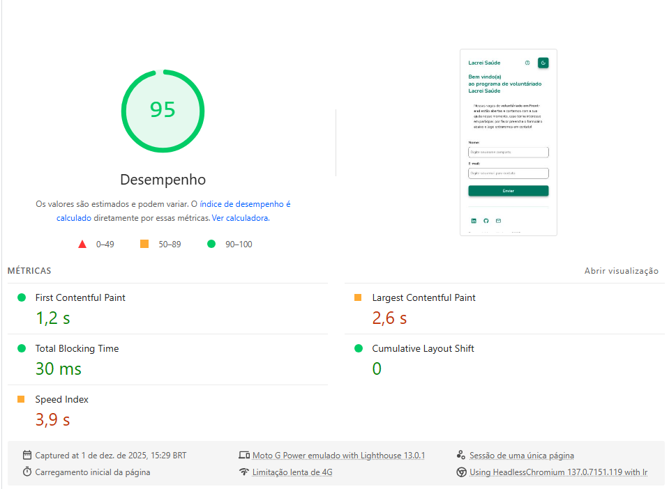
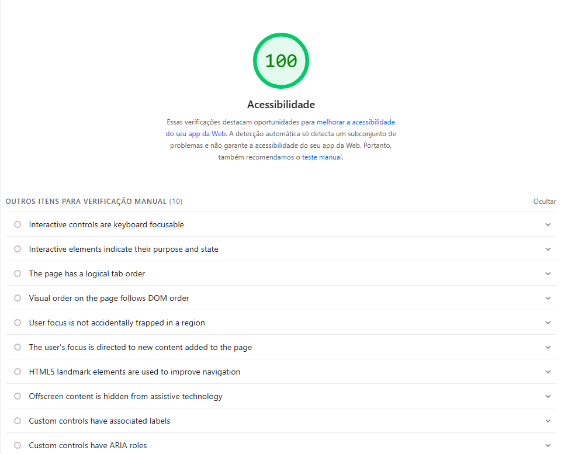
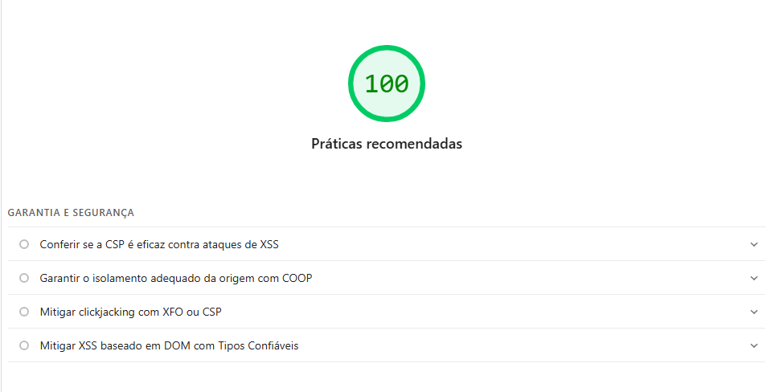
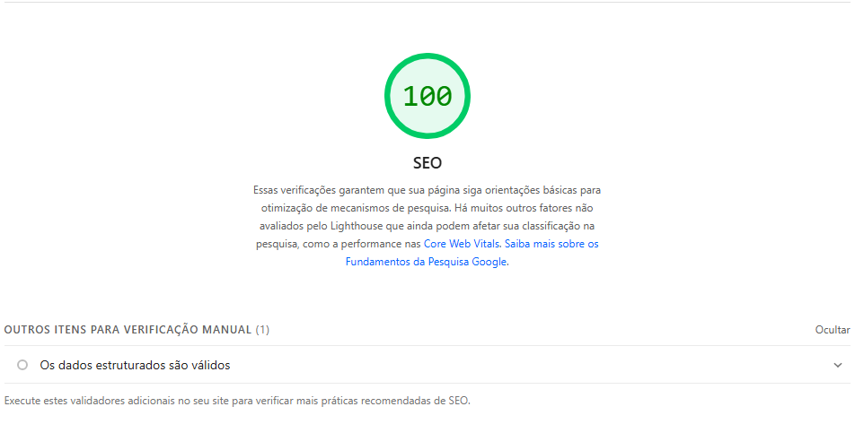

# Lacrei Saúde – Desafio Técnico (Voluntariado)


Aplicação desenvolvida como parte do desafio técnico da **Lacrei Saúde**, com foco na **captação de novos voluntários**.  
O projeto apresenta informações sobre o programa de voluntariado e permite que o usuário se candidate preenchendo um formulário simples e acessível.

## 🚀 Tecnologias Utilizadas

- **Next.js (App Router)**
- **TypeScript**
- **Styled-Components**
- **Redux Toolkit**
- **Zod + React Hook Form**
- **Jest + Testing Library**
- **LocalStorage**
- **Design System Marsha** + referências visuais do site da [Lacrei Saúde](https://lacreisaude.com.br/)
- Técnica **Mobile First**

## 📄 Funcionalidades

- Página principal com:
  - Formulário de candidatura (nome + e-mail)
  - Tratativa de erros e mensagens de feedback
  - Componentes reutilizáveis (botão, inputs)
- Página de ajuda com detalhes do projeto
- Troca de tema (claro/escuro) utilizando **Redux** + **LocalStorage**
- Layout completamente responsivo
- Cuidados com **acessibilidade**, incluindo:
  - `aria-labels`
  - HTML semântico
  - Contraste adequado

## ⚙️ Detalhamento Técnico

Validação de Formulários -
**React Hook Form + Zod**:

- Performance nos campos, evitando que sejam renderizados a cada alteração no input.
- Validação dos dados de maneira robusta, centralizada e clara feita pelo Zod.

Estado Global - **Redux Toolkit**:

- Centraliza o estado global da aplicação em uma store, evitando que sejam passadas muitas props desnecessárias para os componentes.
- Reduz a complexidade do código, deixando os componentes mais claros.
- Armazena o estado independente de onde o usuário esteja na página.

Armazenamento Local - **localStorage**:

- Armazena o tema preferido do usuário, garantindo persistência da escolha em novas sessões.

## 🧩 Estrutura do Projeto

O projeto segue uma estrutura modular com componentes pequenos, para facilitar a manutenção, navegação, compreensão do código, testes unitários, evolução do projeto e reutilização de código.

```bash
/app
/components
/styles → Estilos globais
/store → Redux Toolkit
/providers → Theme provider e redux provider
/schemas → Local separado para schemas do Zod e tipagem do formulário
```

O formulário foi construído em um único componente principal, utilizando inputs e botões reaproveitáveis e validados com **Zod** + **React Hook Form**.

## 🧪 Testes


Os testes foram desenvolvidos com **Jest** e **React Testing Library**, cobrindo todos os componentes unitários e a página **Home**:

### **Home**

- Teste completo do fluxo do formulário
- Preenchimento dos campos
- Clique no botão de envio
- Retorno ao estado inicial após submissão

### **Header**

- Renderização correta
- Alteração do tema
- Links de navegação

### **Footer**

- Renderização correta
- Links de navegação

### **Form**

- Digitação nos campos
- Clique no botão de submit

### **Input**

- Mensagem de Erro e Label customizadas

### **Button**

- Executa função genérica
- Diferetes Estilos


## ⚙️ CI/CD

Link para Actions: https://github.com/hudpr10/desafio-tecnico-lacrei-saude/actions

A cada push ou Pull Request, o GitHub Actions executa:

- Lint (ESLint)
- Testes (Jest)
- Build do projeto

Link para Deploys: https://github.com/hudpr10/desafio-tecnico-lacrei-saude/deployments

A cada push na **main**, a Vercel faz automaticamente o deploy

### Evidências


## Notas no Lighthouse

Relatório Lighthouse: https://pagespeed.web.dev/analysis/https-desafio-tecnico-lacrei-saude-ecru-vercel-app/ykleqcwmfn?hl=pt-br&form_factor=mobile

Feito em: 1 de dez. de 2025, 15:29:59







## 🛠️ Como Rodar o Projeto

1. Certifique-se de ter o **Node.js** instalado.
2. Instale as dependências:

```bash
npm install
```

3. Execute o servidor local:

```bash
npm run dev
```

4. Acesse o navegador

```bash
http://localhost:3000
```

5. Para executar os testes basta rodar:

```bash
npm test
```

Obs: Nenhuma variável de ambiente é necessária.

## 🌐 Deploy

O projeto está hospedado na Vercel:

- Link: https://desafio-tecnico-lacrei-saude-ecru.vercel.app/

## 👈 Rollback

O Rollback na Vercel é muito simples, a plataforma a cada `push` feito no github a Vercel realiza um deploy novo do projeto e todos os deploys anteriores ficam guardados na plataforma, basta clicar no deploy desejado e "promover" ele. Essa operação também pode ser realizada pela CLI digitando o comando:

```bash
vercel rollback deploy_id
```

Vale mencionar que quando feito pelo CLI é necessário ter o id respectivo do deploy desejado.
