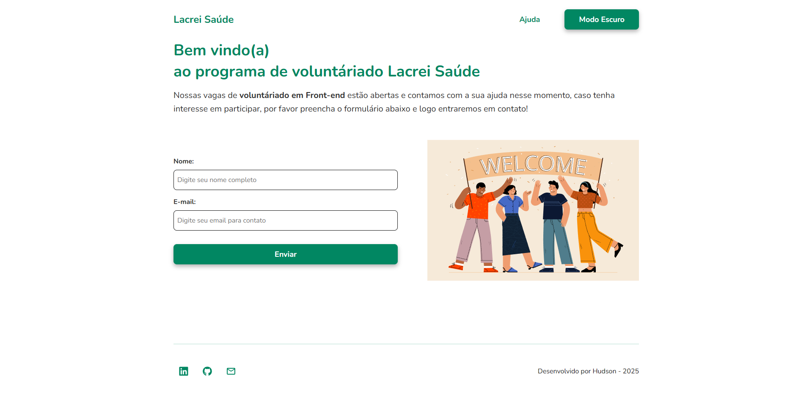

# Lacrei Saúde – Desafio Técnico (Voluntariado)



Aplicação desenvolvida como parte do desafio técnico da **Lacrei Saúde**, com foco na **captação de novos voluntários**.  
O projeto apresenta informações sobre o programa de voluntariado e permite que o usuário se candidate preenchendo um formulário simples e acessível.

---

## 🚀 Tecnologias Utilizadas

- **Next.js (App Router)**
- **TypeScript**
- **Styled-Components**
- **Redux Toolkit** (ajuda para controlar o estado global da aplicação, evitando props desnecessárias)
- **Zod + React Hook Form** (validação dos campos de maneira clara e objetiva)
- **Jest + Testing Library**
- **LocalStorage** (armazenamento do tema da aplicação)
- **Design System Marsha** + referências visuais do site da [Lacrei Saúde](https://lacreisaude.com.br/)
- Técnica **Mobile First**

---

## 📄 Funcionalidades

- Página principal com:
  - Formulário de candidatura (nome + e-mail)
  - Tratativa de erros e mensagens de feedback
  - Componentes reutilizáveis (botão, inputs)
- Página de ajuda com detalhes do projeto
- Troca de tema (claro/escuro) utilizando **Redux** + **LocalStorage**
- Layout completamente responsivo
- Cuidados com **acessibilidade**, incluindo:
  - `aria-labels`
  - HTML semântico
  - Contraste adequado
  - Navegação confortável por teclado

---

## 🧩 Estrutura do Projeto

```bash
/app
/components
/styles → estilos globais
/store → Redux Toolkit
/providers → Theme provider, redux provider, etc.
```

O formulário foi construído em um único componente principal, utilizando inputs e botões reaproveitáveis e validados com **Zod** + **React Hook Form**.

---

## 🧪 Testes

Os testes foram desenvolvidos com **Jest** e **React Testing Library**, cobrindo quatro áreas principais:

### **Home**

- Teste completo do fluxo do formulário
- Preenchimento dos campos
- Clique no botão de envio
- Retorno ao estado inicial após submissão

### **Header**

- Renderização correta
- Alteração do tema

### **Footer**

- Renderização correta

### **Form**

- Digitação nos campos
- Clique no botão de submit


---

## 🛠️ Como Rodar o Projeto

1. Certifique-se de ter o **Node.js** instalado.
2. Instale as dependências:

```bash
npm install
```

3. Execute o servidor local:

```bash
npm run dev
```

4. Acesse o navegador

```bash
http://localhost:3000
```

5. Para executar os testes basta rodar:

```bash
npm test
```

Obs: Nenhuma variável de ambiente é necessária.

## 🌐 Deploy

O projeto está hospedado na Vercel:

- Link: https://desafio-tecnico-lacrei-saude-ecru.vercel.app/
